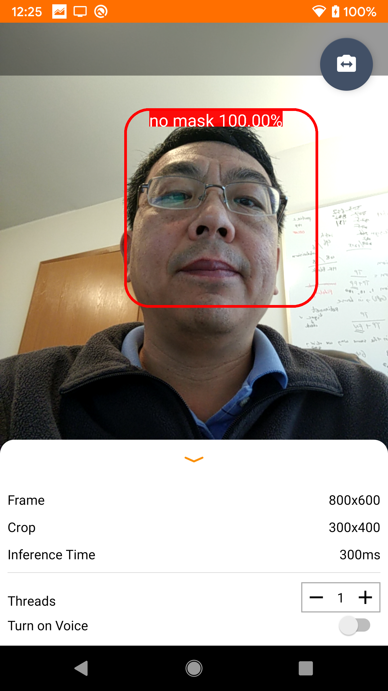
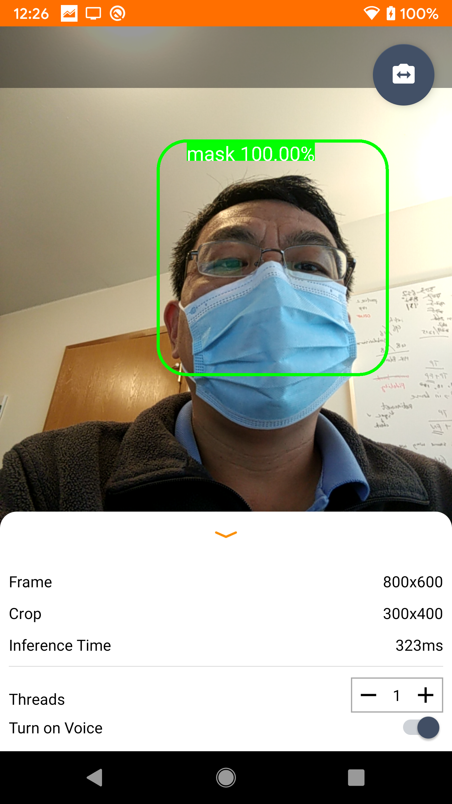
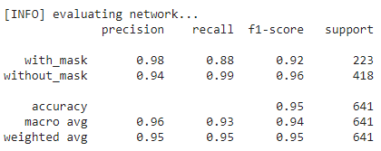

# A Real World Face Mask Detection/Tracking with Voice Warning in Android for Social Good 

      

This face mask detector app with a cheap smart phone on a stand can be easily deployed at the entrance of a corner store, and the entrance of an office building,
by the door of the conference room to friendly remind people to wear masks.

This app is absolutely free, you can use it for social good.

### Overview
I am WFH for almost one year. As a research scientist, I am thinking: Is there anything I can do to help move my colleagues and me to office (return to normal)? 
I have tried to donate masks, we did a lot of efforts to buy masks oversea, and donate money to buy masks, it seems it is just a drop in the ocean, it just disappeared.
 how I can be mentally healthy? My living space is limited, I need to be distracted from the physical world, the instinct mind is to apply my machine learning background 
 to detect/track face masks and remind people to wear masks, it will kill my time, and maybe it will be useful. 
 
### Environment
  * Android Studio/Java
  * Google Pixel XL (an old goodle phone.)
  (Place the Google Pixel XL phone in Portraint position.)

You can download and install the Android App at:[Android/apk](https://github.com/liminghu/facemaskdetector/blob/main/android/apk/facemaskdetector.apk) folder.

The facemaskdetector app. is for social good, there is no room for social injustice, but the facemaskdetector model is based on the training data, if you notice any issue, pls let me 
know, I will retrain the model based on the new data.  

### How good/bad is the face mask detector's performance?

According to the validation data, the face mask detector can achieve 95% accuracy on telling non mask face from masked face.
Do we need to achieve perfect accuracy? No. Did you notice the speed radar and the warning board by the road? it does not need to be perfect to let people slow down.
 
 
### What's Next?
  * Make it work properly for landscape mode.
  * widely test it on other android phones.
  
## I am standing on others' shoulders:
  * a good blog post for face mask detector:(https://www.pyimagesearch.com/2020/05/04/covid-19-face-mask-detector-with-opencv-keras-tensorflow-and-deep-learning/) 
  * https://github.com/tensorflow/examples/tree/master/lite/examples/object_detection/android
    (if you follow: https://github.com/tensorflow/examples/tree/master/lite/examples/object_detection/ios, this facemask detector can be easily ported to an iphone IOS app.)
  * https://github.com/estebanuri/facemaskdetector
  * https://medium.com/@estebanuri/real-time-face-mask-recognition-in-android-with-tensorflow-lite-215df6327265
  * MobileNetV2 (I also tried MobileNetV3Small and MobileNetV3Large, MobileNetV2 is better. it could be some hyperparameter issues.)

## DataSets
I did review the data, and clean the dataset, add some more random images online.
  * https://github.com/prajnasb/observations
  * https://github.com/estebanuri/facemask_data
  * https://github.com/AIZOOTech/FaceMaskDetection
  * https://www.kaggle.com/andrewmvd/face-mask-detection

